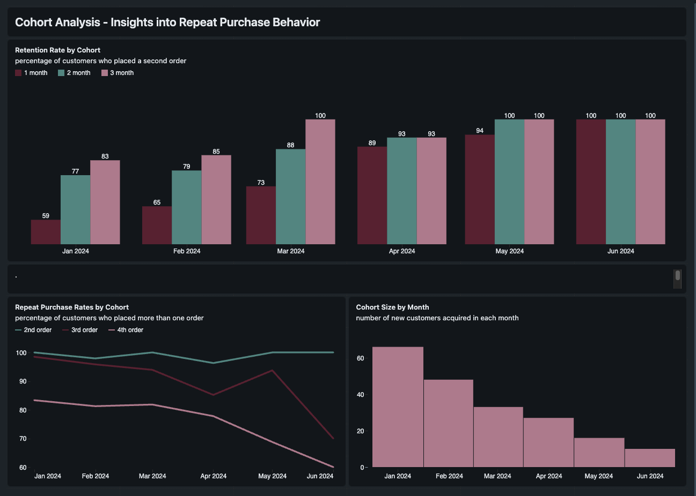

# 🔗 ETL & Cohort Analysis 

## 🧾 Project Overview

This project provides an end-to-end data pipeline and analytical framework designed to evaluate new-customer behaviour, retention, and repeat-purchase dynamics through cohort analysis. Focusing on customers acquired in 2024, the solution combines **automated data ingestion**, **cloud-based storage**, **scalable transformations**, and **curated analytics** to generate meaningful insights into customer engagement and long-term value.

A **structured Databricks medallion architecture (bronze–silver–gold)** ensures data quality and analytical reliability throughout the process. Raw data from BigQuery is ingested into the bronze layer, refined into a clean and structured cohort dataset in silver, and curated into gold-layer analytical tables that enable detailed retention and repeat-purchase evaluations. These curated results are **visualized in a Databricks dashboard**, illustrating how customer behaviour evolves across monthly acquisition cohorts and providing clear visibility into customer lifecycle performance.


## 🎯 Objectives

The primary objectives of the project are:

- Understand how newly acquired customers behave over time.
- Measure retention and repeat-purchase patterns across monthly cohorts.
- Identify differences in purchasing behaviour between customer groups.
- Detect acquisition trends throughout 2024.
- Provide actionable insights to support customer-retention and marketing strategies.


## 🗂️ Data Source

The analysis is based on customer and transaction data covering the year 2024, including:

- 200 new customers
- 1,000 total orders
- sales by customer


## 🔧 Transformation Process

To deliver a robust and scalable foundation for cohort analysis, the project integrates multiple data platforms and applies a structured transformation workflow within Databricks.

### 1. Platform Integration

- **Google Cloud SQL / BigQuery** serves as the central storage platform for raw and structured data prior to transformation.
- **Fivetran** automates the extraction of transactional and customer data from operational systems and continuously syncs updates to the data warehouse.
- **Databricks** performs the full transformation workflow, including data preparation, SQL-based modeling, and cohort construction at scale.

### 2. Medallion Architecture (Bronze–Silver–Gold)

The Databricks transformation logic follows the standard medallion architecture:

- **Bronze Layer** – Raw data already clean is imported from BigQuery into Databricks exactly as ingested by Fivetran, preserving source fidelity.

- **Silver Layer** – Refined data is standardized, and modeled using SQL to produce the `cohort_analysis` table with **total_orders**, **first_order_date** and **second_order_date** which forms the analytical foundation for subsequent calculations.

- **Gold Layer** - Final analytical datasets are generated for direct analysis and visualization, including:
  - `retention_rate` – retention performance within 1, 2 and 3 month across cohorts
  - `repeat_purchase_rates` – repeated orders across cohorts
  - `cohort_size` – number of customers for each cohort
 
### **3. Curated Analytics & Dashboard Visualization**

The final curated analytical tables are presented in a **Databricks dashboard**, enabling interactive exploration of how customer behaviour evolves across time and across cohorts.


## 📊 Visualization




## 🔍 Key Takeaways

### 1. Strong Retention in Later Cohorts 

- Later cohorts, particularly **April to June**, exhibit **very strong retention performance**.
- The **June cohort** stands out with a **100% retention rate across every time threshold**, making it the strongest-performing cohort overall.
- There is a **notable upward trend in short-term customer retention** when comparing early to later cohorts. The **January cohort** shows a relatively weak repeat-purchase rate of **59% in the first month** while **all customers in the June cohort made a second purchase within a short time**, indicating exceptionally high early engagement.

### 2. Repeat-Purchase Behaviour Depends on Both Time and Order Frequency

- Although overall repeat behaviour is strong, the **repeat-purchase rate decreases as the total number of orders increases**.
- This effect must be interpreted in the context of different time windows across cohorts. While **May and June cohorts** have had **less time** since their first purchase, naturally limiting the number of possible follow-up orders. In comparison earlier cohorts (**January–March**) had more time to progress through multiple purchase cycles and show more stable, long-term behaviour — with **repeat-purchase rates above 80% for the 3rd and 4th order**.

### 3. Declining New Customer Acquisition Throughout the Year

- **January is the largest cohort**, with **66 new customers**, significantly outperforming the rest of the year.
- After January, the number of newly acquired customers **declines continuously** month over month.
- From **July onward, no new customers were acquired**, highlighting a sharp drop in acquisition performance in the second half of the year.


## 💡 Recommendations

### 1. Extend the Cohort Analysis Across Multiple Years

To better understand the significant acquisition drop after July and the exceptional short-term retention of the May and June cohorts, a **multi-year cohort analysis** (ideally at least 3 years) should be conducted. This broader time window will help determine:

- Whether the acquisition decline is **structural, seasonal, or campaign-related**.
- Whether the unusually **strong 1-month retention in the May/June cohorts has occurred in past years** or was triggered by specific **promotions, market conditions, or seasonal behaviour**.

Extending the analysis will provide more reliable trend detection and improve long-term strategic planning.

### 2. Strengthen Marketing Investment to Counter Acquisition Decline

The sharp fall in customer acquisition —culminating in **no new customers after July**— highlights a need to reinforce marketing activities and lead-generation channels.
Recommended measures include:

- **Increased marketing spend** during historically weak periods.
- **Targeted campaigns** aimed at revitalizing acquisition momentum.
- **Promotional incentives** such as discounts for second purchases to encourage early engagement and repeat behaviour.

### 3. Invest Strategically in New Customer Acquisition

Although acquiring customers is costly, the data indicates an urgent need to **rebuild a consistent acquisition funnel**, particularly given the complete stop in new customers from July onward.
Strategic acquisition efforts should focus on:

- Channels with historically strong performance.
- Target groups resembling the high-performing later cohorts (April–June).
- Optimizing conversion paths to stabilize monthly customer intake.

### 4. Leverage High-Performing Cohorts to Improve Onboarding & Engagement

Early 2024 cohorts (January–March) and the high-performing later cohorts (May–June) exhibit distinct behavioural patterns that can be used to optimize the onboarding process.
Recommendations include:

- Analysing touchpoints, communications, and promotions that contributed to the strong early behaviour in the May/June cohorts.
- Applying these findings to future onboarding strategies to improve early retention and accelerate the second purchase cycle.


## 🗂️ Directory Structure

```
cohort-analysis/
│
├── raw-data/
│      ├──bronze_ecom_orders.csv
│
├── datasets/
│      ├── silver_cohort_analysis.ipynb
│      └── gold_retention_rate.ipynb
│      └── gold_repeat_purchase.ipynb
│      └── gold_cohort_size.ipynb
│
├── dashboard/
│      └── databricks_dashboard.png
│
├── README.md
│
└── .gitignore
```

## 🪪 License

This project is licensed for **educational and demonstration purposes only**. All data used is **fictional** and does not represent real business information.

